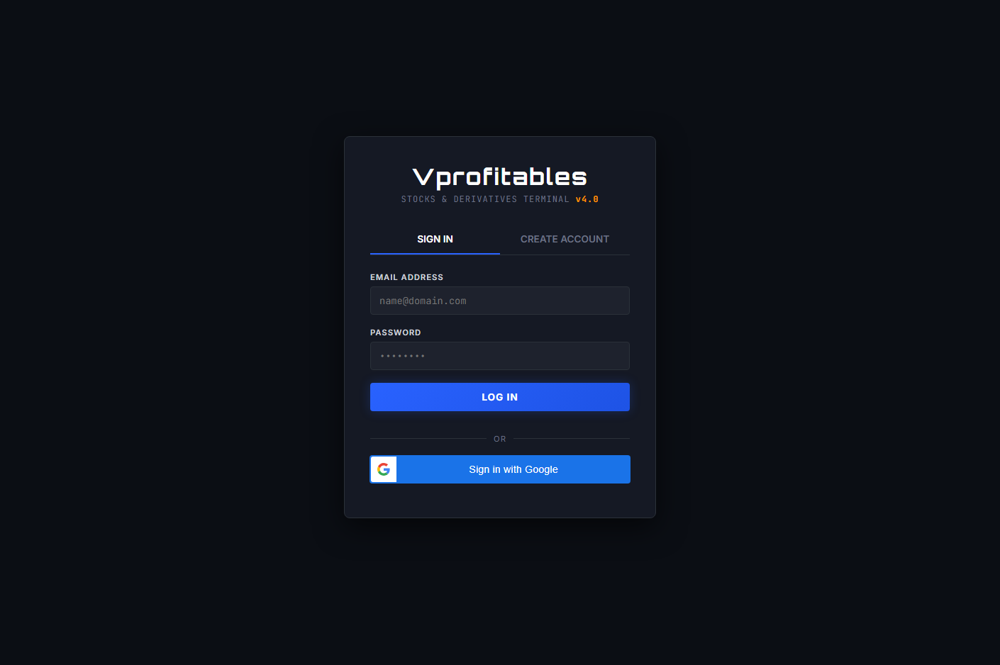
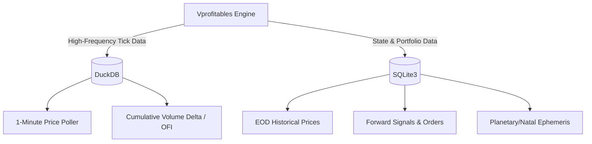

<div align="center">
  
  <h1>Vprofitables: Institutional Quant & AI Trading Engine</h1>
  <p><i>A proprietary-grade quantitative platform blending Machine Learning, Time-Frequency Analysis, and Microstructure Order Flow into a seamless Progressive Web App.</i></p>

  []()
  []()
  []()
  []()
</div>

---

## 📸 The Vprofitables Story (Platform Interface)

Vprofitables is designed as a single-page progressive web application. Here is a tour of the core modules:

### 1. Market Overview (Home)
<div align="center">
  
  <br/><em>Live market gainers, losers, and quick research recommendations.</em>
</div>
<br>

### 2. AI Investment Advisor
<div align="center">
  
  <br/><em>Generates multi-stock portfolios using 5 layers of logic (Gann, ML, Natal, Fundamentals, Sentiment).</em>
</div>
<br>

### 3. Forward Testing & Live Tracker
<div align="center">
  
  <br/><em>Tracks live paper trades with dynamic trailing stop-losses and risk-reward calculation.</em>
</div>
<br>

### 4. Quant & Charting Engine
<div align="center">
  
  <br/><em>Visualizes support/resistance levels, order blocks, and execution points directly on the chart.</em>
</div>

---

## 🧠 Model Engineering (The Alpha Generation)

Vprofitables does not rely on static retail indicators. Our core engine utilizes advanced financial mathematics to extract true market alpha.

### 1. Continual Learning Ensemble (`SGDClassifier`)
Instead of static predictive models that suffer from "concept drift," our AI uses an online learning architecture. At the end of every trading day, the model uses `partial_fit` to incrementally adjust its weights based on live trading outcomes. 

### 2. Time-Frequency Cycle Extraction (`CWT`)
We replaced standard Fourier Transforms with **Continuous Wavelet Transforms (Morlet Wavelets)**. This allows the engine to isolate non-stationary, localized market cycles (like a 45-day macroeconomic rhythm) that standard FFT equations miss.

### 3. Market-Neutral Statistical Arbitrage
When the broader market (NIFTY 50) goes flat, the engine scans for highly cointegrated equity pairs (e.g., HDFCBANK vs ICICIBANK). By calculating the spread `Z-Score`, the engine executes market-neutral mean-reversion trades.

---

## 🗄️ Database Architecture

To achieve sub-millisecond query times on massive tick data while maintaining structured relational data, Vprofitables uses a **Hybrid Database Architecture**:



*   **DuckDB:** Acts as our in-memory OLAP engine. It ingests 1-minute polled data and calculates Cumulative Volume Delta (CVD) proxies on the fly.
*   **SQLite3:** Acts as our persistent OLTP store, managing user portfolios, swing-trade forward signals, and the heavy daily EOD caching.

---

## 🧪 Institutional Backtesting & Evaluation

We don't trust standard backtests. Vprofitables employs rigorous statistical methods to prevent p-hacking (curve fitting).

*   **Monte Carlo Permutations:** Shuffles the sequence of historical trade returns 10,000 times to simulate alternative market realities, outputting the **True Maximum Drawdown (95% CI)**.
*   **Deflated Sharpe Ratio (DSR):** Mathematically discounts the Sharpe Ratio based on the variance and the number of backtest iterations run, ensuring the strategy is statistically significant.

---

## 🚀 One-Click Deployment

Run Vprofitables on any machine (Windows, Mac, Linux) seamlessly using Docker.

### 1. Via Docker (Recommended)
```bash
git clone https://github.com/chirag-kaura/vprofitables.git
cd vprofitables
docker-compose up --build -d
```
Navigate to [http://localhost:8080](http://localhost:8080) to access the Terminal.

### 2. Via Python (Locally)
```bash
pip install -r requirements.txt
python app.py
```

## 🤝 Contributing
Open-sourced for the quantitative finance community. Pull requests for new alpha strategies and broker API integrations (Zerodha, Interactive Brokers) are welcome!

## 📝 License
MIT License.
